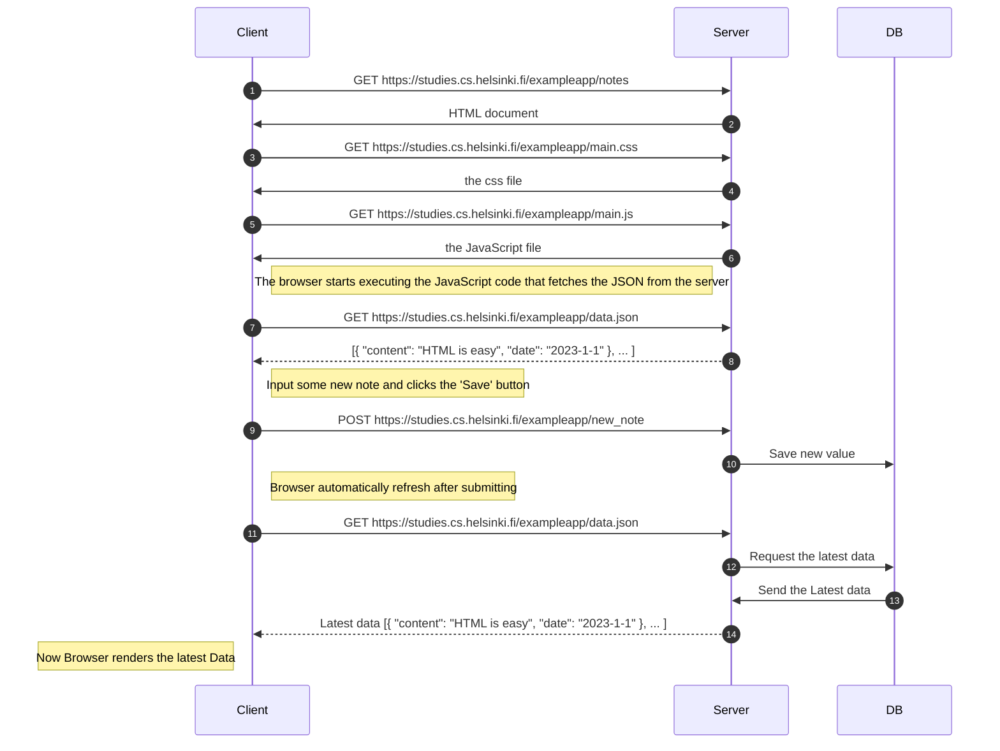

```mermaid
sequenceDiagram
	autonumber
	Client->>Server: GET https://studies.cs.helsinki.fi/exampleapp/notes
	Server->>Client: HTML document
	Client->>Server:  GET https://studies.cs.helsinki.fi/exampleapp/main.css
	Server->>Client:  the css file
	Client->>Server:  GET https://studies.cs.helsinki.fi/exampleapp/main.js
	Server->>Client:  the JavaScript file
	Note right of Client: The browser starts executing the JavaScript code that fetches the JSON from the server
	Client->>Server: GET https://studies.cs.helsinki.fi/exampleapp/data.json
	Server-->>Client: [{ "content": "HTML is easy", "date": "2023-1-1" }, ... ]
	Note right of Client: Input some new note and clicks the 'Save' button
	Client->>Server: POST https://studies.cs.helsinki.fi/exampleapp/new_note
	Server->>DB    : Save new value
	Note right of Client: Browser automatically refresh after submitting
	Client->>Server:  GET https://studies.cs.helsinki.fi/exampleapp/data.json
	Server->>DB    :  Request the latest data
	DB->>Server    :  Send the Latest data
	Server-->>Client: Latest data [{ "content": "HTML is easy", "date": "2023-1-1" }, ... ]
	Note Left of Client: Now Browser renders the latest Data
```
